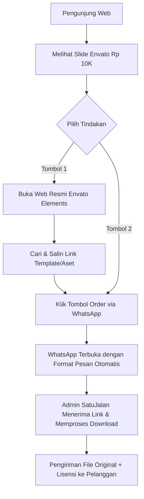
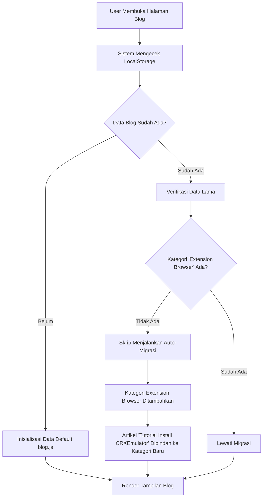

# Laporan Pembaruan Sistem Web SatuJalan

Berikut adalah dokumentasi lengkap beserta flowchart dari semua penambahan fitur dan perbaikan yang telah berhasil kita integrasikan (dan di-deploy ke server live) pada sesi pembaruan kali ini.

## 1. Pembaruan Layanan (Jasa Download Envato Elements)
Fitur baru telah ditambahkan ke *Hero Carousel* di halaman utama (`index.html`, `index_en.html`, `index_ar.html`).

### Flowchart Pemesanan Jasa Envato

**Perbaikan Teknis yang Dilakukan:**
- **Optimalisasi SVG:** Mengedit *ViewBox* dari `envato-elements-logo-vector.svg` untuk menghilangkan ruang transparan berlebih sehingga logo utuh dan proporsional.
- **Copywriting Conversion:** Mengubah teks promosi menjadi penawaran *hard-selling* ("Mulai Rp 10K/File") untuk memicu konversi lebih tinggi ketimbang pengguna harus membayar langganan bulanan Rp 300rb.
- **Mobile Responsive:** Menyematkan CSS khusus mode *mobile* (`max-width: 768px`) agar jarak margin, padding, dan ukuran huruf mengecil secara otomatis, sehingga kedua tombol (Cari & WhatsApp) **langsung terlihat (above-the-fold)** tanpa perlu *scroll* ke bawah.

---

## 2. Pembaruan Sistem Blog & Knowledge Base
Penambahan Kategori Tutorial Ekstensi Browser dan penanganan migrasi sistem yang cerdas.

### Flowchart Sistem Blog & Auto-Migrasi

**Perbaikan Teknis yang Dilakukan:**
- **Kategori Baru:** Menambahkan filter "Extension Browser" pada `blog.html`.
- **Auto-Migration Data Lama:** Mengembangkan logika *patching* di `blog.js` agar pengunjung yang masih menyimpan cache/data lama di perambannya (*LocalStorage*) tidak mengalami error (artikel tutorial ID 3 otomatis diarahkan ke kategori ekstensi secara aman).

---

## 3. Pembaruan Desain Tema (Terang/Gelap)
Optimalisasi tingkat keterbacaan teks yang sebelumnya sulit dibaca saat berada dalam Mode Terang (*Light Mode*).

**Perbaikan Teknis yang Dilakukan:**
- **Global CSS Variables:** Melakukan sentralisasi kode warna menggunakan CSS Variables di `style.css`.
- **Penghapusan Hardcode Color:** Menghapus pewarnaan *hardcode* di dalam `blog.html` dan `article.html` yang sebelumnya memaksa font menjadi putih (sehingga tak terlihat di latar belakang putih). Teks sekarang otomatis mengikuti warna mode yang sedang aktif.

> [!TIP]
> **Status:** Semua kode dari 3 pembaruan besar di atas **telah selesai di-deploy** dan berstatus *LIVE* di server Vercel/Cloudflare (berada di branch `main` repositori GitHub).
