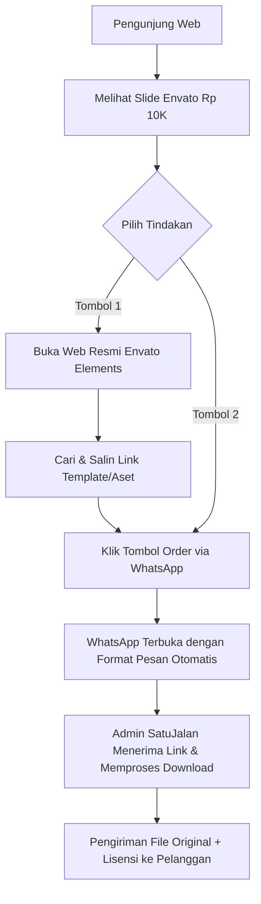
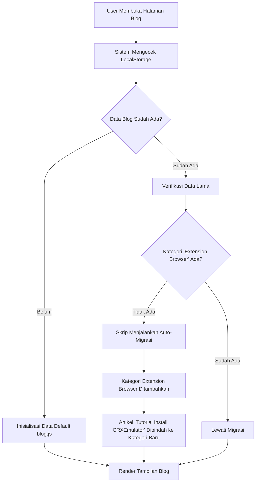
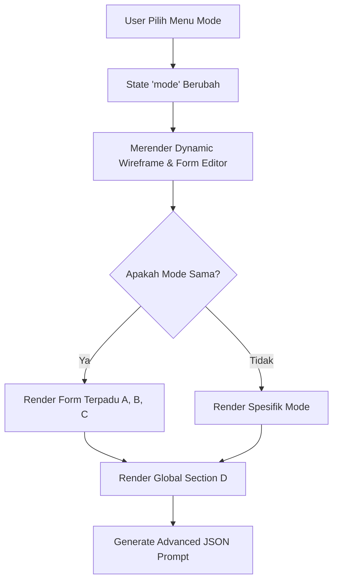
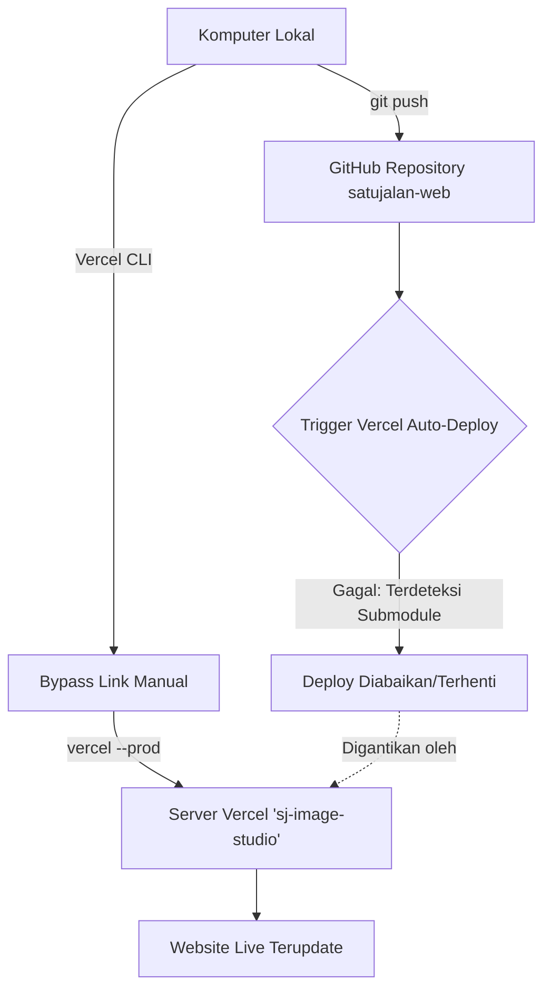
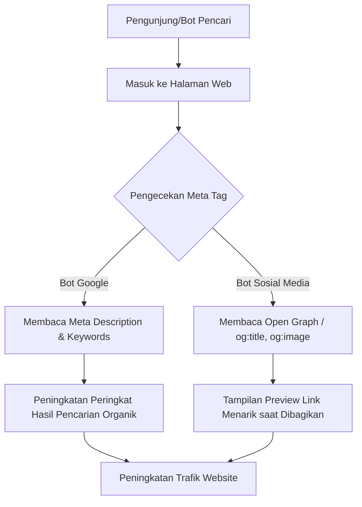
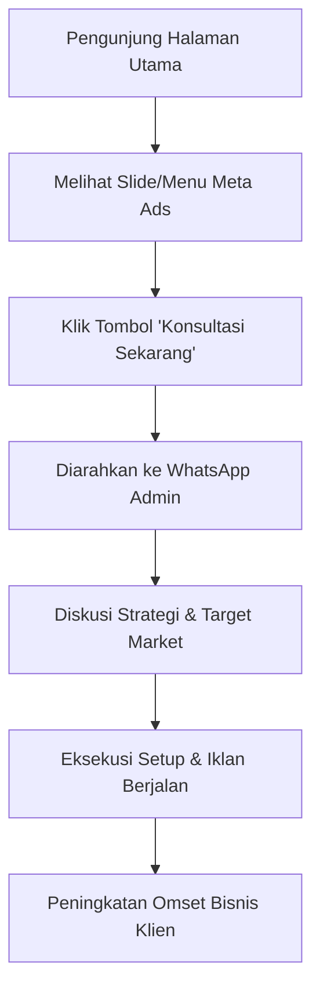

# Laporan Pembaruan Sistem Web SatuJalan

Berikut adalah dokumentasi lengkap beserta flowchart dari semua penambahan fitur dan perbaikan yang telah berhasil kita integrasikan (dan di-deploy ke server live) pada sesi pembaruan kali ini.

## 1. Pembaruan Layanan (Jasa Download Envato Elements)
Fitur baru telah ditambahkan ke *Hero Carousel* di halaman utama (`index.html`, `index_en.html`, `index_ar.html`).

### Flowchart Pemesanan Jasa Envato

**Perbaikan Teknis yang Dilakukan:**
- **Optimalisasi SVG:** Mengedit *ViewBox* dari `envato-elements-logo-vector.svg` untuk menghilangkan ruang transparan berlebih sehingga logo utuh dan proporsional.
- **Copywriting Conversion:** Mengubah teks promosi menjadi penawaran *hard-selling* ("Mulai Rp 10K/File") untuk memicu konversi lebih tinggi ketimbang pengguna harus membayar langganan bulanan Rp 300rb.
- **Mobile Responsive:** Menyematkan CSS khusus mode *mobile* (`max-width: 768px`) agar jarak margin, padding, dan ukuran huruf mengecil secara otomatis, sehingga kedua tombol (Cari & WhatsApp) **langsung terlihat (above-the-fold)** tanpa perlu *scroll* ke bawah.

---

## 2. Pembaruan Sistem Blog & Knowledge Base
Penambahan Kategori Tutorial Ekstensi Browser dan penanganan migrasi sistem yang cerdas.

### Flowchart Sistem Blog & Auto-Migrasi

**Perbaikan Teknis yang Dilakukan:**
- **Kategori Baru:** Menambahkan filter "Extension Browser" pada `blog.html`.
- **Auto-Migration Data Lama:** Mengembangkan logika *patching* di `blog.js` agar pengunjung yang masih menyimpan cache/data lama di perambannya (*LocalStorage*) tidak mengalami error (artikel tutorial ID 3 otomatis diarahkan ke kategori ekstensi secara aman).

---

## 3. Pembaruan Desain Tema (Terang/Gelap)
Optimalisasi tingkat keterbacaan teks yang sebelumnya sulit dibaca saat berada dalam Mode Terang (*Light Mode*).

**Perbaikan Teknis yang Dilakukan:**
- **Global CSS Variables:** Melakukan sentralisasi kode warna menggunakan CSS Variables di `style.css`.
- **Penghapusan Hardcode Color:** Menghapus pewarnaan *hardcode* di dalam `blog.html` dan `article.html` yang sebelumnya memaksa font menjadi putih (sehingga tak terlihat di latar belakang putih). Teks sekarang otomatis mengikuti warna mode yang sedang aktif.

## 4. Pembaruan UI/UX Terminal Prompt & Mode Editor (My Design Studio)
Penyempurnaan signifikan pada struktur dan layout mode interaktif (Design SJ, Ads Typography, dll).

### Flowchart Perbaikan UI Mode Editor

**Perbaikan Teknis yang Dilakukan:**
- **Dynamic Wireframe Canvas:** Mengganti *mockup wireframe* yang statis menjadi dinamis (`renderWireframe`) yang selalu menyesuaikan dengan input mode dari user (Visual Placement, Aspect Ratio, dll).
- **Refactoring & Redundansi Kode:** Menghapus sekitar 400+ baris kode redundan (duplikat form "A. Informasi Brand", "B. Fitur", "C. Layout") yang tumpang tindih untuk `mode === 'design-feeds'`.
- **Penggabungan State UI:** Menyatukan logika form UI antara **Ads Typography** dan **Design SJ** agar menggunakan blok interaktif yang sama persis dan elegan, menghasilkan konsistensi tampilan tanpa adanya kolom ganda.
- **Perbaikan JSON Generator:** Memperbaiki variabel di fungsi `generatePrompt` agar merujuk pada `state` terbaru (`brandName`, `hook`) sehingga *prompt output* sesuai dengan isian user.
- **Scroll UX:** Memperbaiki masalah *overflow* dan batas tinggi layar, memastikan seluruh tombol *Generate* dan *Copy JSON* tetap mudah diakses.

## 5. Perbaikan Integrasi Vercel & Koreksi Penamaan Menu
Menyelesaikan masalah *build deployment* yang terhambat akibat miskonfigurasi struktur repositori Git serta asinkronisasi terjemahan.

### Flowchart Arsitektur Bypass Deployment

**Penjelasan Arsitektur & Perbaikan Teknis yang Dilakukan:**
- **Resolusi Git Submodule (Gitlink):** Menghapus struktur `.git` mandiri di dalam folder `my-design-studio/frontend` yang sebelumnya menyebabkan Vercel gagal menarik (*pull*) data kode terbaru karena terdeteksi sebagai *submodule* kosong. Folder frontend kini diintegrasikan penuh ke dalam *root repository* `satujalan-web`.
- **Force Direct Deploy Vercel CLI:** Meresolusi isu di mana *project* Vercel `sj-image-studio` mengabaikan *trigger* otomatis dari GitHub akibat riwayat *submodule* yang terputus. Deployment dilakukan paksa (override) menggunakan Vercel CLI secara manual sehingga kode lokal langsung masuk ke *Production*.
- **Resolusi TypeScript Build:** Memperbaiki *type error* pada komponen `MagneticButton.tsx` (mengganti pewarisan tipe menjadi `HTMLMotionProps<"button">` dari `framer-motion`) agar proses kompilasi Next.js di *server production* berjalan mulus tanpa hambatan.
- **Sinkronisasi Terjemahan (EN & AR):** Memperbaiki teks statis pada data terjemahan Bahasa Inggris (English) dan Bahasa Arab (Arabic) yang sebelumnya masih tertulis "Feeds" di Sidebar (misal: *Carousel Feeds*, *Design Feeds*). Semuanya kini tersinkronisasi menjadi **Carousel SJ**, **Design SJ**, dan **9 SJ Konsisten** mengikuti format Bahasa Indonesia.
- **Koreksi Copywriting Menu Navbar:** Merevisi teks navigasi *dropdown* Produk Kami pada halaman statis (`index.html`, `index_en.html`, `index_ar.html`) dari "SJ IMAGE" (atau "SJ Disen Design") menjadi **SJ Design** agar seragam dengan identitas baru aplikasi.

> [!TIP]
> **Status Akhir:** Seluruh kode dari 5 rangkaian pembaruan besar di atas **telah 100% selesai di-deploy** dan berstatus *LIVE* di server Vercel/Cloudflare (berada di branch `main` repositori GitHub).

## 6. Optimalisasi SEO dan Analitik Trafik (Pembaruan Terbaru)
Menyempurnakan konfigurasi tag meta Search Engine Optimization (SEO) dan tag Open Graph pada halaman-halaman sekunder agar situs web lebih mudah terdeteksi, diindeks, serta memiliki pratinjau (*preview*) yang menarik saat dibagikan ke media sosial (WhatsApp, Facebook, Twitter, dll).

### Flowchart Implementasi Meta SEO

**Perbaikan Teknis yang Dilakukan:**
- **Injeksi Meta Tag (SEO):** Menambahkan `meta description`, `keywords`, dan `author` yang mendetail pada halaman sekunder.
- **Konfigurasi Open Graph:** Memasang tag `og:title`, `og:description`, `og:url`, `og:image`, dan `og:type` (website/article) untuk menyempurnakan rich preview saat URL disebarkan.
- **Implementasi pada Halaman Berikut:**
  - `about.html`
  - `blog.html`
  - `article.html`
  - `tracking.html`
  - `tracking_en.html`
- **Penyembunyian Panel Admin:** Menambahkan tag `robots` bernilai `noindex, nofollow` khusus pada `admin.html` agar tidak dapat di-crawl maupun muncul di pencarian publik demi keamanan akses (*Security Best Practice*).
- **Perbaikan Resolusi Gambar WhatsApp (Open Graph):** Menghilangkan *prefix* `www.` pada atribut `og:image` dan `twitter:image` di seluruh halaman statis (`satujalan.id`). Hal ini memperbaiki *bug* di mana *crawler* WhatsApp gagal menampilkan gambar *preview* karena terhalang oleh sistem *redirect 308* dari URL `www` ke *non-www*.
- **Injeksi SEO pada Aplikasi Next.js (Finance AI):** Mengimplementasikan ekspor metadata Google SEO & Open Graph di `app.satujalan.id` (`src/app/layout.tsx`), memastikan aplikasi Next.js (Vercel) otomatis memuat `Title`, `Description`, dan memanggil Logo HD secara dinamis sesuai identitas *tenant*.

## 7. Penambahan Jasa Iklan Meta Ads (Landing Page)
Menambahkan layanan unggulan baru berupa Jasa Iklan Meta (Facebook & Instagram Ads) di halaman depan untuk mendorong konversi *marketing* yang lebih agresif dengan penawaran *hard-selling*.

### Flowchart Akuisisi Pelanggan Meta Ads

**Perbaikan Teknis yang Dilakukan:**
- **Pembaruan Navigasi:** Menambahkan item *dropdown* spesifik untuk "Jasa Iklan Meta Ads" pada struktur *Navbar* (`index.html`).
- **Hero Slider (Promo Slide):** Menambahkan *Slide* ke-4 khusus di korsel utama dengan gradasi estetis dan *copywriting* persuasif ("Tingkatkan Omset... Mulai Rp 300K").
- **Penambahan Service Card:** Menyematkan kartu layanan baru khusus Meta Ads di *section* Solusi Cepat (`.services-grid`), lengkap dengan poin-poin fitur seperti Iklan Tertarget, Strategi Jitu, dan Laporan Transparan.

> [!TIP]
> **Status Akhir Keseluruhan:** Seluruh kode pembaruan (Perbaikan OG Meta WhatsApp, SEO Next.js Finance App, dan Penambahan Jasa Meta Ads) **telah 100% selesai** dan di-push ke repositori GitHub. Pembaruan pada *hosting* manual (cPanel) menggunakan ZIP (*batch update*) telah diringkas untuk efisiensi deploy.
